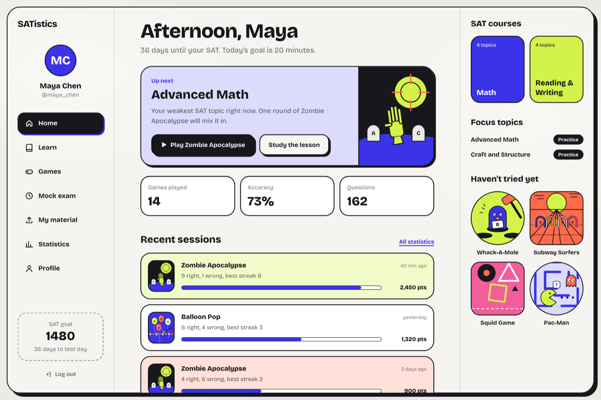

<h1 align="center">SATistics</h1>

<p align="center">SAT and GRE practice that plays like an arcade. Real-format exam questions inside six games, concept lessons with videos, and a dashboard that points you at your weakest topic.</p>

<p align="center"><a href="https://www.satistic.tech">Live site</a> · <a href="docs/handbook/index.html">Engineering handbook</a> · <a href="CONTRIBUTING.md">Contribute</a> · <a href="https://www.satistic.tech/developer">Developer</a></p>

<p align="center">
  <a href="https://github.com/shivvyas2/SATistics/actions/workflows/ci.yml"></a>
  <a href="LICENSE"></a>
  
  
  
</p>

<p align="center"></p>

SATistics turns test prep into something students want to open. Every zombie, mole, balloon and gate carries a real-format SAT or GRE question; answer right to keep playing. Around the games sits a full study loop: learn a concept, watch a lesson, check yourself, then lock it in with a game. An AI agent watches your accuracy per topic and steers new questions toward what you miss.

It started at NYU Hacks as a weekend project and has grown into a complete prep platform. It is now open source, and this repo is set up so you can pick one area and start contributing without learning all of it.

## Features

- **Six arcade games.** Zombie Apocalypse, Whack-A-Mole, Balloon Pop, Subway Surfers, Squid Game and Pac-Man, built with Three.js and canvas. Each one turns answering into gameplay.
- **Real-format questions.** SAT questions come from the College Board's public question bank, GRE and extra questions are found on the web or written by an LLM to the official spec, and an offline bank keeps the games working with no keys at all.
- **Two exams, four courses.** SAT Math, SAT Reading and Writing, GRE Quant and GRE Verbal, organized by the official content domains.
- **Learn.** A lesson for every topic: key ideas, a worked example revealed step by step, common traps, a quick check, and ranked YouTube lessons.
- **Mock exams and your own material.** Mock exams at quick, module or full-section length with a rough score estimate. Upload a practice test or your notes, review the questions pulled out of it, and the ones you approve show up in your games.
- **Profiles and a dashboard.** Exam, target score, test-day countdown and a daily goal, plus recent sessions, focus topics and an "up next" recommendation.

## Tech stack

| Layer | Technology |
| --- | --- |
| Frontend | Next.js 14 (App Router), React 18, TypeScript, Tailwind CSS |
| Games | Three.js, HTML canvas, Yuka |
| Backend | FastAPI (Python), Pydantic |
| Database and auth | Supabase (Postgres, Auth, Row Level Security) |
| AI | OpenRouter (default model Claude Haiku 4.5) |
| Questions and search | College Board question bank (SAT), DuckDuckGo (questions and videos), optional YouTube Data API and Serper |
| Hosting | Vercel, two projects: frontend and backend |

## Architecture

```
                 ┌──────────────────────────┐
  Browser ──────►│  Next.js (frontend/)     │
                 │  pages, games, lessons   │
                 └────────────┬─────────────┘
                              │  fetch + Bearer token
                 ┌────────────▼─────────────┐      ┌──────────────────────┐
                 │  FastAPI (backend/)      │─────►│ OpenRouter (LLM)     │
                 │  /api/auth /api/profile  │─────►│ YouTube / Serper /   │
                 │  /api/questions /learn   │      │ DuckDuckGo search    │
                 │  /api/games /stats ...   │      └──────────────────────┘
                 └────────────┬─────────────┘
                              │  service-role key
                 ┌────────────▼─────────────┐
                 │  Supabase                │
                 │  Postgres + Auth + RLS   │
                 └──────────────────────────┘
```

The browser never talks to Supabase directly. It signs in through the backend, keeps the session token, and sends it as a Bearer token on every API call. The backend holds the service-role key and the AI and search keys, and none of them ever reach the browser.

## Repository layout

```
.
├── frontend/                 Next.js app
│   ├── app/                  Routes: landing, auth, dashboard, learn, games, mock, materials, profile, stats, developer
│   ├── components/           UI: brand, arcade frame, exam UI, game containers, learn, profile
│   ├── games/                Game engines, one folder per game
│   ├── lib/                  API client, exams and courses, lessons, question bank, sessions, site metadata
│   └── public/               3D models, textures and audio
├── backend/                  FastAPI app
│   ├── api/index.py          Vercel entry point
│   ├── src/api/              Routers: auth, profile, questions, learn, games, stats, materials, health
│   ├── src/services/         Question agent, question sources, videos, materials, auth, scores
│   ├── src/models/           Pydantic schemas
│   └── database/             SQL: reset.sql, then add_materials.sql, create the schema
├── docs/
│   ├── handbook/             The engineering handbook (HTML, PDF, EPUB) and its sources
│   └── images/               Screenshots
└── .github/                  CI, issue and pull request templates
```

## Getting started

You need Node.js 18 or newer, Python 3.9 or newer, and a free Supabase project.

**1. Database.** In the Supabase SQL editor of a *new* project, run [`backend/database/reset.sql`](backend/database/reset.sql), then [`backend/database/add_materials.sql`](backend/database/add_materials.sql). Together they create every table, trigger and policy. `reset.sql` also drops existing tables and deletes all auth users, so never run it against a project with real users.

**2. Backend.**

```sh
cd backend
cp .env.example .env          # fill in the Supabase values at minimum
python3 -m venv venv && source venv/bin/activate
pip install -r requirements.txt
uvicorn src.main:app --reload --port 8000
```

Check it with `curl http://localhost:8000/api/health/`.

**3. Frontend.**

```sh
cd frontend
cp .env.example .env.local
npm install
npm run dev
```

Open http://localhost:3000, create an account, and play.

### What each integration unlocks

| Variable | Needed for | Without it |
| --- | --- | --- |
| `SUPABASE_URL`, `SUPABASE_SERVICE_ROLE_KEY` | Accounts, profiles, scores, stats | The server starts and `/api/health/` works, but sign-in and every database route fail |
| `OPENROUTER_API_KEY` | AI-written, personalized questions and parsing uploaded material | SAT questions still come from the College Board bank; GRE questions use the built-in offline bank |
| `YOUTUBE_API_KEY` or `SERPER_API_KEY` | Reliable lesson videos | Falls back to DuckDuckGo, which rate limits |
| `ALLOWED_ORIGINS` | Calling the API from a deployed frontend | Only localhost may call it |
| `NEXT_PUBLIC_API_URL` (frontend) | Pointing the site at your backend | Defaults to `http://localhost:8000` |

Every variable is documented in [`backend/.env.example`](backend/.env.example) and [`frontend/.env.example`](frontend/.env.example), and chapter 3 of the handbook walks through getting each key.

## The engineering handbook

[`docs/handbook/`](docs/handbook/) is a book about this codebase: how every part works, why it is shaped that way, and how to change it. Open `index.html` in a browser, or read the PDF or EPUB. Each feature chapter ends with a reading order through the code and questions to check yourself.

| If you want to work on | Start with |
| --- | --- |
| A game, or adding one | Chapters 8 and 9 |
| Questions and the AI agent | Chapters 6 and 7 |
| Lessons and videos | Chapter 10 |
| Dashboard and stats | Chapter 11 |
| Accounts and profiles | Chapter 5 |
| Look and feel | Chapter 4 |
| The API | Chapters 13 and 14 |
| Deploying your own copy | Chapter 15 |

## Contributing

Contributions are welcome, from typo fixes to new games. Read [CONTRIBUTING.md](CONTRIBUTING.md) first, then pick an issue labelled `good first issue` or open one describing what you want to build. Please follow the [Code of Conduct](CODE_OF_CONDUCT.md), and report security problems privately as described in [SECURITY.md](SECURITY.md).

## Credits

Created by [Shiv Vyas](https://www.shivvyas.com) ([LinkedIn](https://www.linkedin.com/in/shivvyas/)). SATistics began at NYU Hacks; thanks to the original hackathon team and to everyone in the commit history.

SAT is a trademark of the College Board and GRE is a trademark of ETS. Neither is affiliated with or endorses this project.

## License

[MIT](LICENSE)
